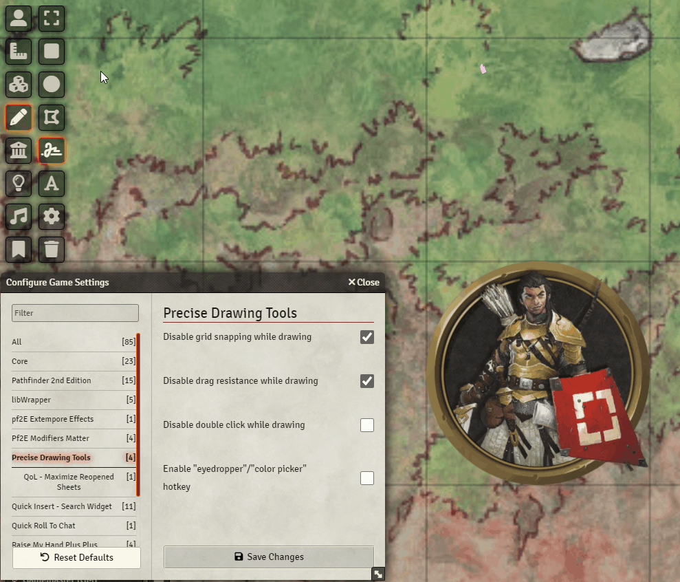
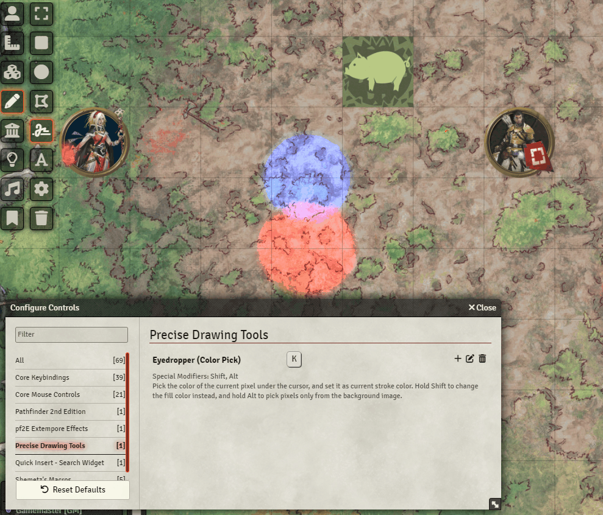

# [Precise Drawing Tools](https://foundryvtt.com/packages/precise-drawing-tools/)

 
 
  

FoundryVTT module to make the drawing tool more precise in several ways.

To install, browse for it in the module browser, or [directly copy the manifest link for the latest release](https://github.com/shemetz/precise-drawing-tools/releases/latest/download/module.json).

# Features

## Disabled grid-snapping when using freehand tool (allow precise starting points for strokes)

## Disabled drag resistance (allow very short strokes)

## Disabled double click (allow rapidly creating strokes)

## Eyedropper / Color Picker (press K to switch to the hovered color)

