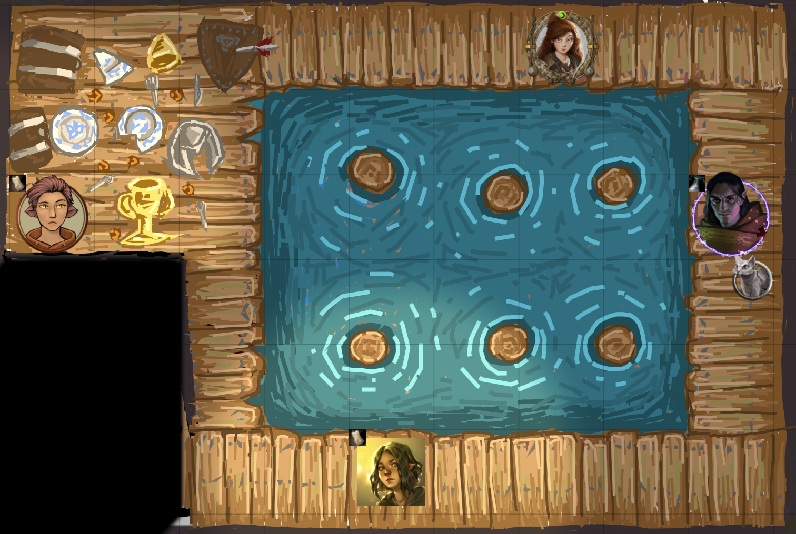

# [Precise Drawing Tools](https://foundryvtt.com/packages/precise-drawing-tools/)

  

FoundryVTT module to make the drawing tool more precise in several ways.

### (With this module and a talent for art, you too can draw amazing and needlessly detailed backgrounds like this one!)

(credit to my friend xin, who still wishes Foundry would add a "real" canvas, with eraser and stroke support.  one day...)

To install, browse for it in the module browser,
or [directly copy the manifest link for the latest release](https://github.com/shemetz/precise-drawing-tools/releases/latest/download/module.json).

# Features (mostly affecting freehand drawing)

## Disabled drag resistance (allow very short strokes)

## Dynamic sampling rate (improve resolution of quick strokes)

## Eyedropper / Color Picker (press K to switch to the hovered color)

Note: this color picker demo gif is outdated, as the feature now **ignores lighting**, which
allows drawings to more seamlessly fit into the background.  However, as of Foundry V12, this requires temporarily
disabling the scene darkness and weather effects as long as the button (K) is held, to ensure that the selected color is
precisely the right color (from the background/tile/token/drawing you're hovering over), rather than a darkened version of it.

## Convert Drawings to Tile (new button in the drawing tools)

Select some drawings, press the button, look at a preview, and then either download the image or set it as a tile (uploading it to `worlds/[your-world-id]/PDT-converted-drawings`).

# Old features - now core behavior as of Foundry V12 (awesome!)

### Disabled grid-snapping (allow precise starting points for strokes)

### Disabled double click (allow rapidly creating strokes)

